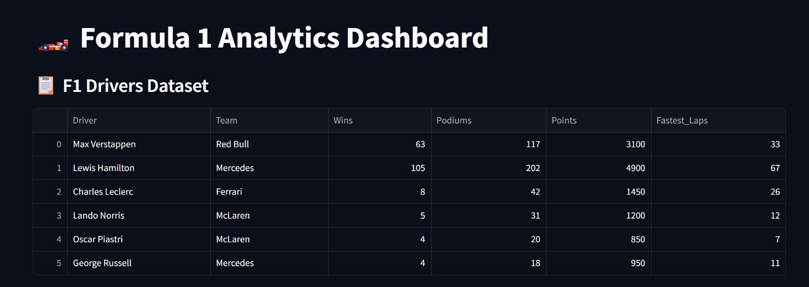
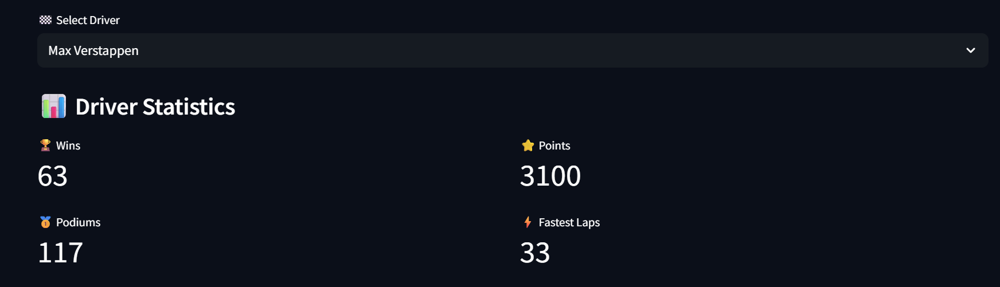
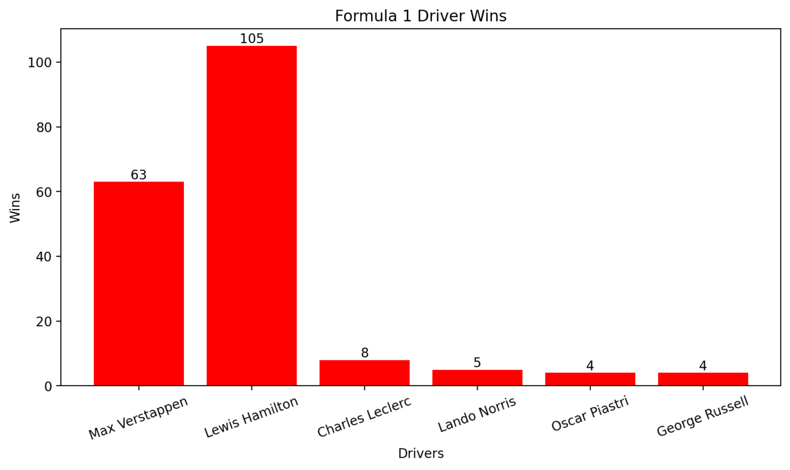

# 🏎️ Formula 1 Analytics Dashboard

A modern Formula 1 analytics dashboard built using **Python, Streamlit, Pandas, and Matplotlib**. This project enables users to explore Formula 1 driver statistics, compare performance metrics, and visualize driver performance through an interactive dashboard.

## 🚀 Features

- Interactive driver selection
- Driver performance statistics
- Wins, Podiums, Points, and Fastest Laps metrics
- Driver wins comparison chart
- Greatest driver identification
- Interactive and user-friendly dashboard
- Dark-themed interface
- Data visualization using Matplotlib

## 📸 Screenshots

### Dashboard Overview



### Driver Statistics



### Wins Comparison Chart



## 📂 Project Structure

```text
F1-Analytics-Dashboard/
│
├── data/
│   └── f1_drivers.csv
│
├── screenshots/
│   ├── dashboard_overview.png
│   ├── driver_statistics.png
│   └── wins_comparison_chart.png
│
├── app.py
├── requirements.txt
└── README.md
```

## 🛠️ Technologies Used

- Python
- Streamlit
- Pandas
- Matplotlib

## ⚙️ Installation

Clone the repository:

```bash
git clone <repository-url>
```

Navigate to the project folder:

```bash
cd F1-Analytics-Dashboard
```

Install dependencies:

```bash
pip install -r requirements.txt
```

Run the dashboard:

```bash
streamlit run app.py
```

## 📊 Dataset

The dataset contains Formula 1 driver information including:

- Driver Name
- Team
- Wins
- Podiums
- Points
- Fastest Laps

## 🎯 Future Improvements

- Team performance analytics
- Advanced driver comparisons
- Interactive filtering options
- Real-time Formula 1 API integration
- Machine Learning race winner prediction
- Enhanced dashboard customization

## ⭐ Support

If you find this project interesting, useful, or unique, consider giving it a ⭐ on GitHub. Your support helps encourage future development and new projects.

---

🏎️ Built with Python, Pandas, Matplotlib, and Streamlit.
